# Hospital Management System

A comprehensive Flutter-based hospital management application designed to streamline patient care, appointment scheduling, and medical record management. The system supports multiple user roles (Admin, Doctor, Patient) with a robust backend powered by Firebase.

## 📋 Table of Contents
- [Features](features)
- [Tech Stack](tech-stack)
- [Project Structure](project-structure)
- [Getting Started](getting-started)
- [Requirements](requirements)
- [Installation](installation)
- [Architecture](architecture)
- [Key Services](key-services)
- [Contributing](contributing)

## ✨ Features

### Patient Features
- **User Authentication**: Secure registration and login with Firebase Auth
- **Appointment Booking**: Schedule appointments with doctors across various departments
- **Medical Records**: View personal medical history and records
- **Doctor Discovery**: Browse available doctors by department
- **Appointment Management**: View, reschedule, and cancel appointments
- **Notifications**: Real-time updates on appointment status

### Doctor Features
- **Doctor Dashboard**: Manage patient appointments and schedules
- **Patient Management**: View patient profiles and medical history
- **Appointment Management**: Accept/decline/complete appointments
- **Department Management**: Manage departmental information

### Admin Features
- **System Management**: Manage doctors, departments, and staff
- **User Management**: Create and manage user accounts
- **Appointment Oversight**: Monitor all system appointments
- **System Reports**: Generate comprehensive reports on hospital operations
- **Analytics**: View system statistics and insights

### General Features
- **Payment Integration**: M-Pesa integration for appointment payments
- **PDF Generation**: Generate and print medical reports and receipts
- **Image Management**: Upload and manage images via Cloudinary
- **Responsive UI**: Beautiful adaptive design using Flutter ScreenUtil
- **Dark Mode Support**: System theme adaptation

## 🛠️ Tech Stack

### Frontend
- **Framework**: Flutter 3.8.1+
- **State Management**: Provider 6.1.5+
- **UI Components**: Material Design 3

### Backend & Services
- **Firebase Core**: v4.1.0
- **Cloud Firestore**: v6.0.1 (Database)
- **Firebase Auth**: v6.0.2 (Authentication)
- **Firebase Storage**: v13.0.2 (File Storage)

### Integrations
- **Payment**: M-Pesa payment gateway integration
- **Image Storage**: Cloudinary integration
- **PDF Generation**: pdf & printing packages
- **Image Picker**: Native image selection

### UI/UX Libraries
- **Google Fonts**: v6.3.1
- **Flutter SVG**: v2.2.1
- **Shimmer**: v3.0.0 (Loading states)
- **Flutter Staggered Animations**: v1.1.1
- **Flutter ScreenUtil**: v5.9.3 (Responsive design)

## � Screenshots

### Authentication
| Login | Registration |
|-------|--------------|
| 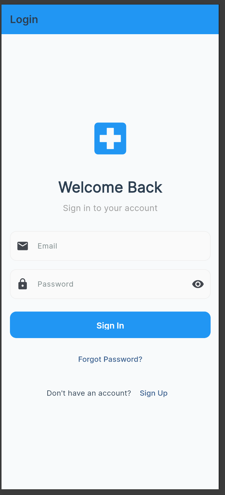 | 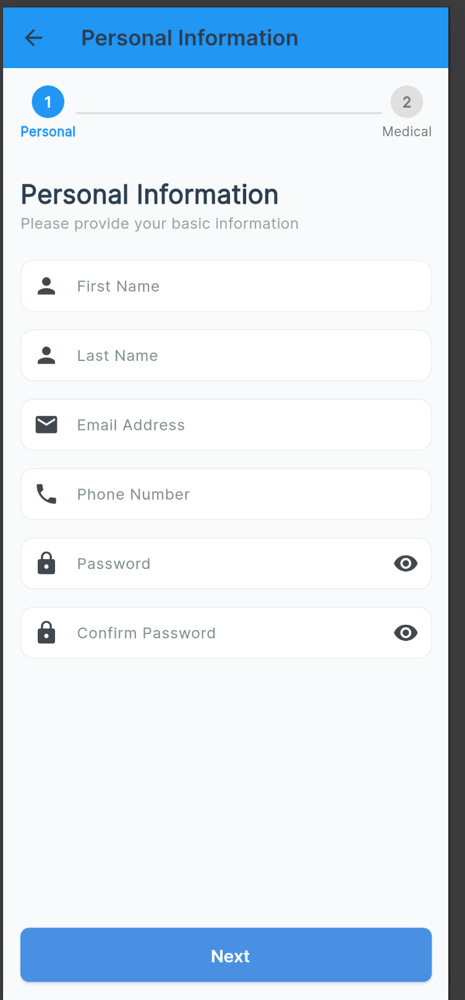 ,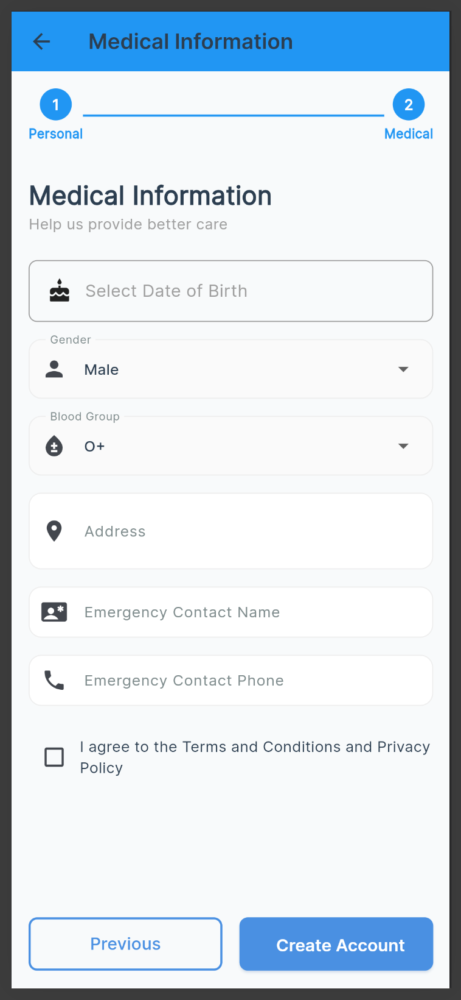 |

### Patient Features
| Dashboard | Appointments | Doctor Search |
|-----------|--------------|---------------|
| 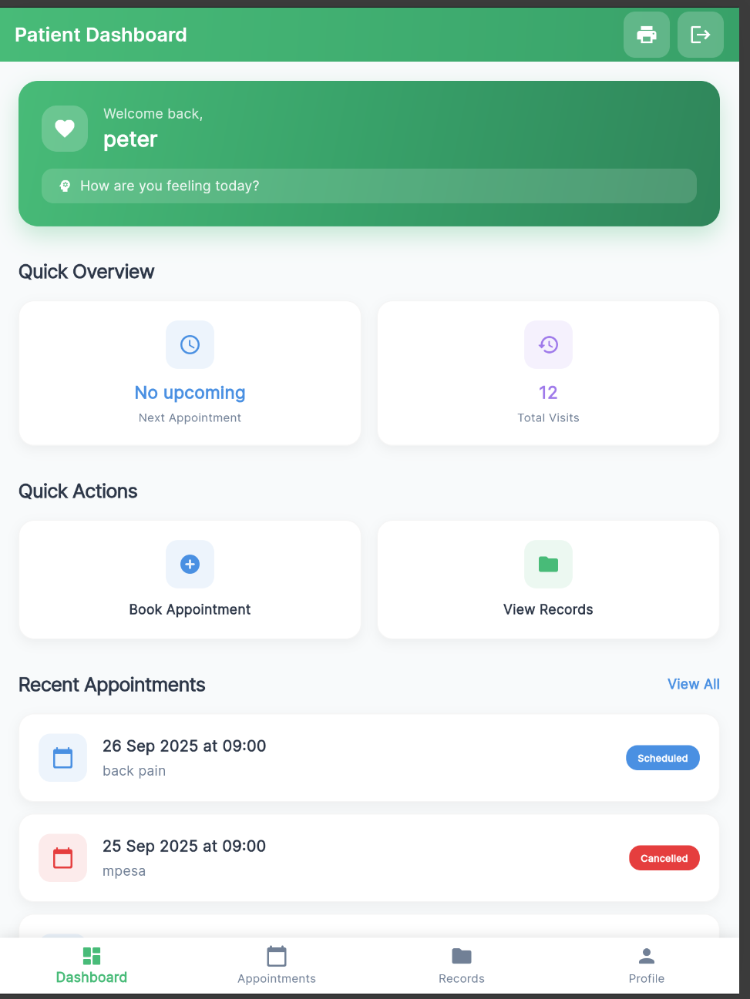 | 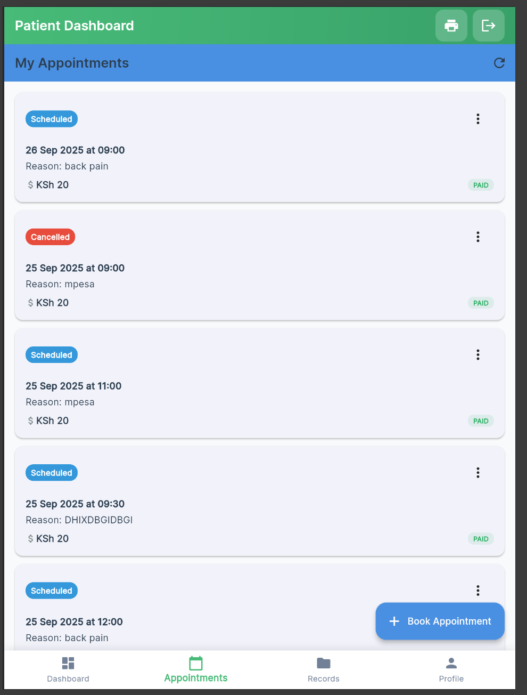 | 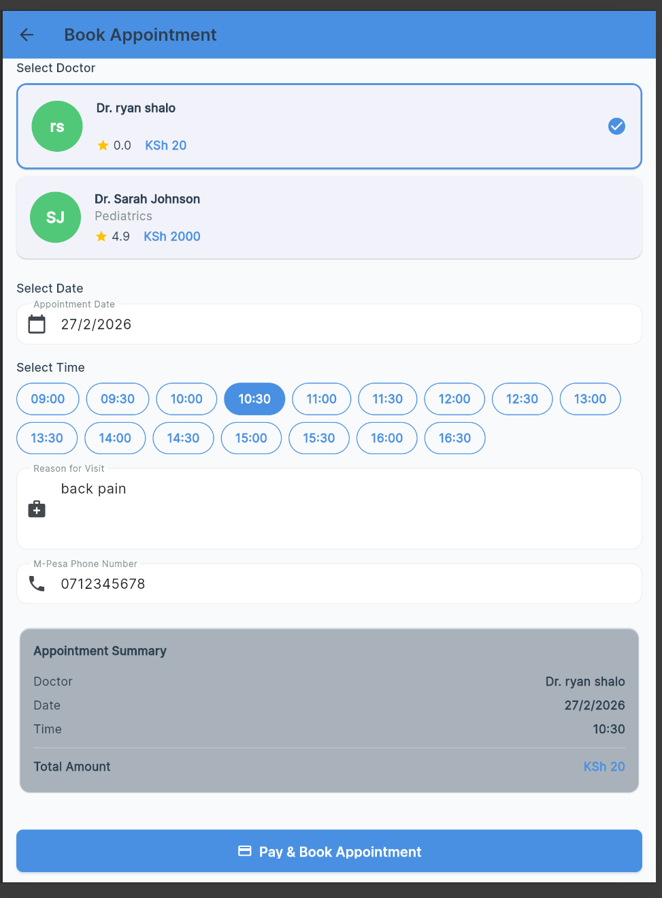 |

| Book Appointment | Medical Records | Profile |
|-----------------|-----------------|---------|
|  | 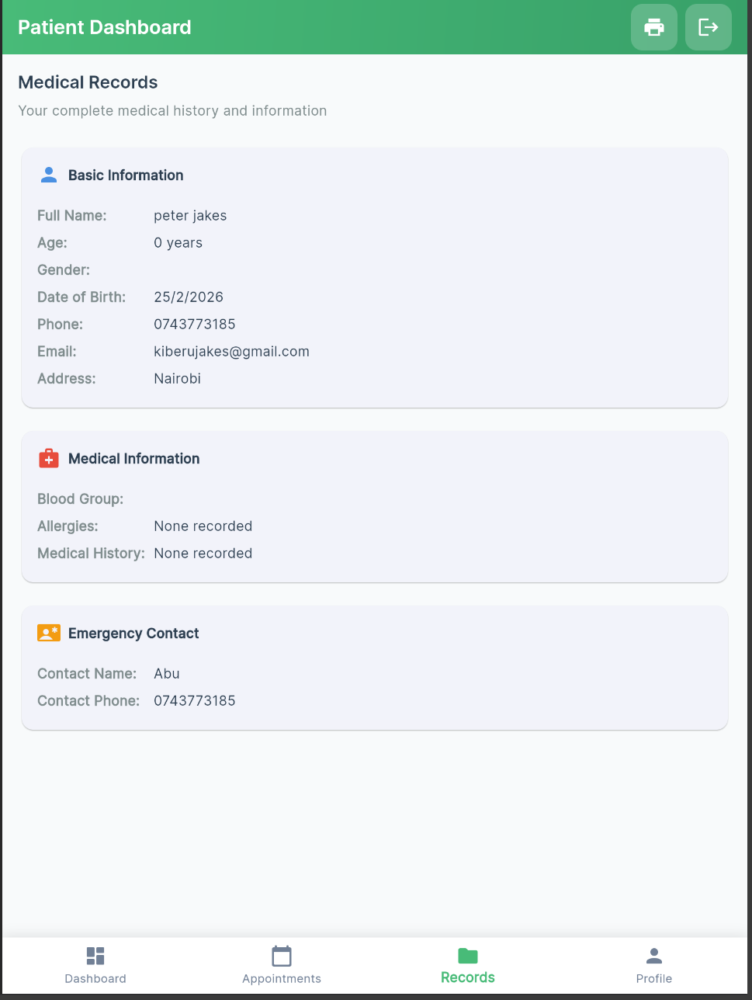 | 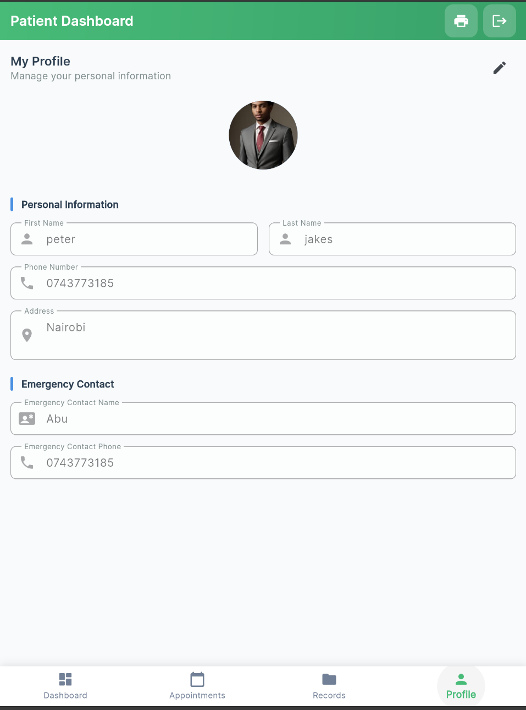 |

### Doctor Features
| Dashboard | Patient List | Appointments |
|-----------|--------------|--------------|
| 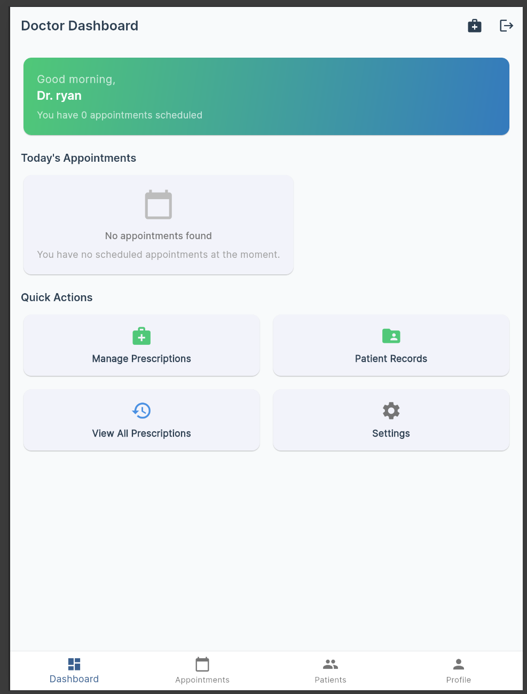 | 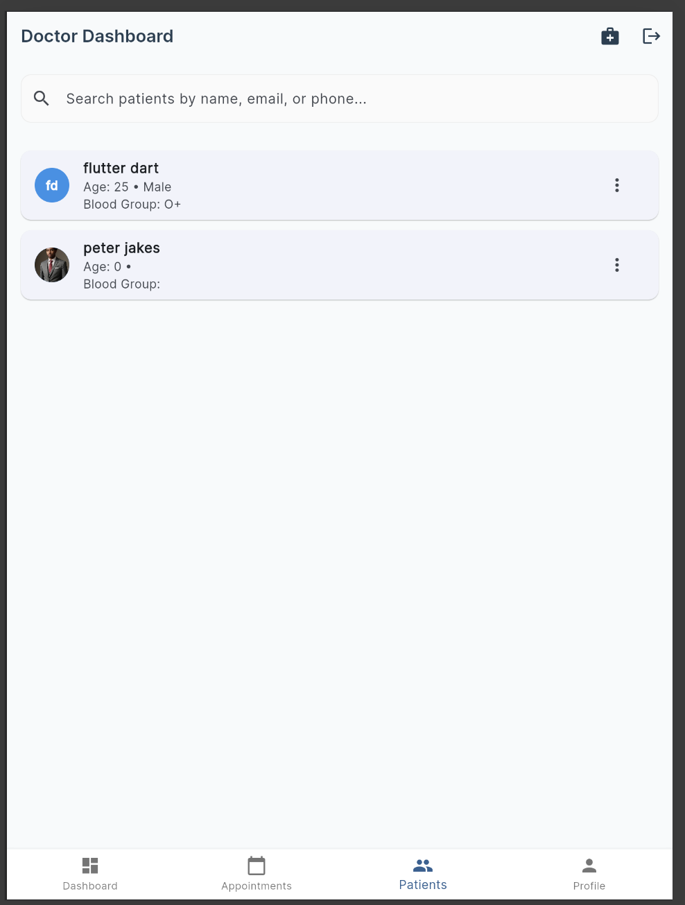 | 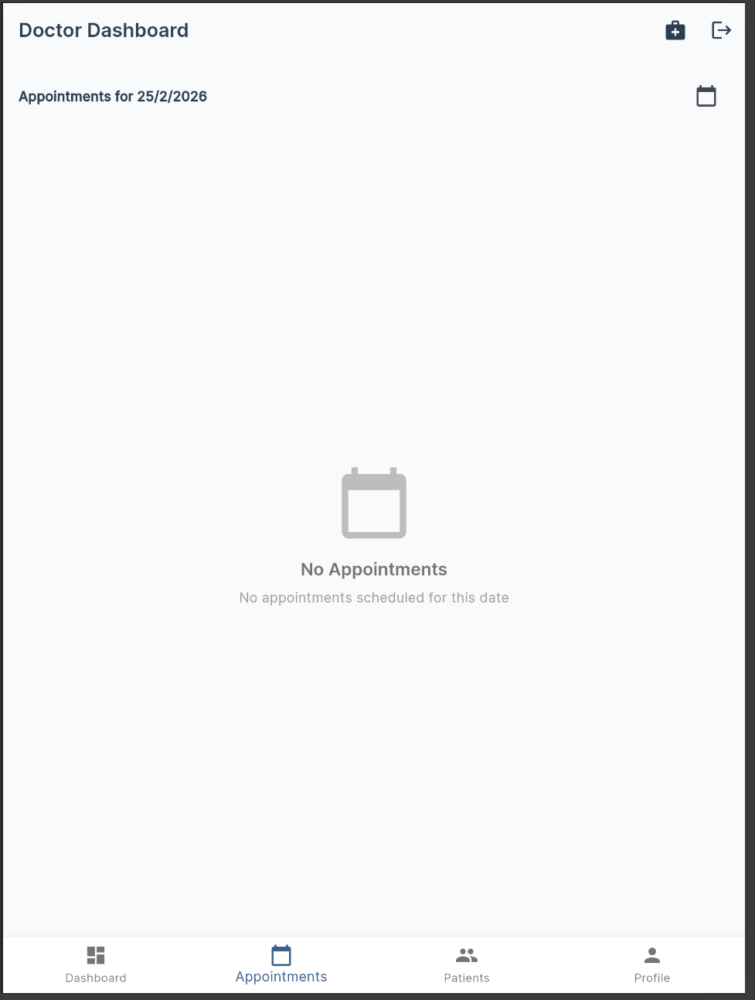 |

### Admin Features
| Dashboard | User Management | Reports |
|-----------|-----------------|---------|
| 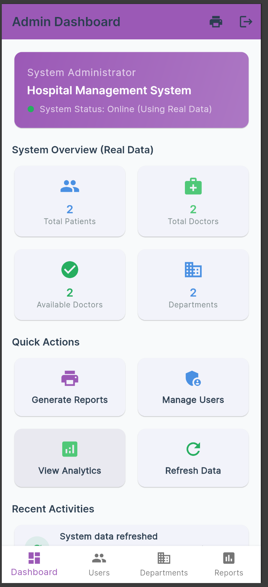 | 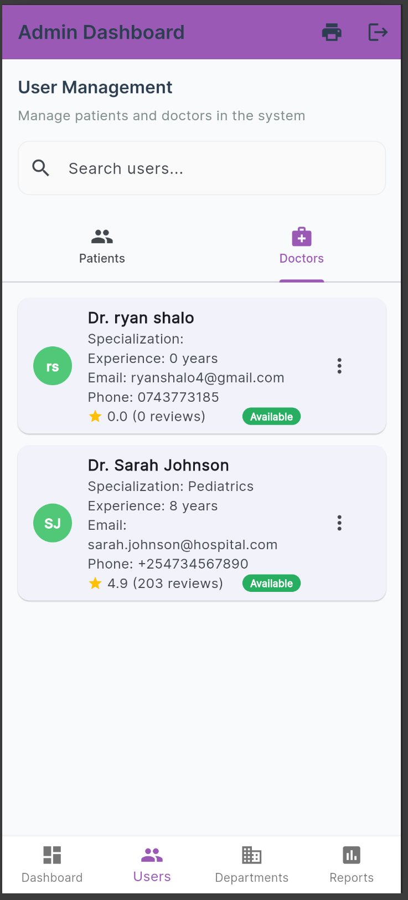 ,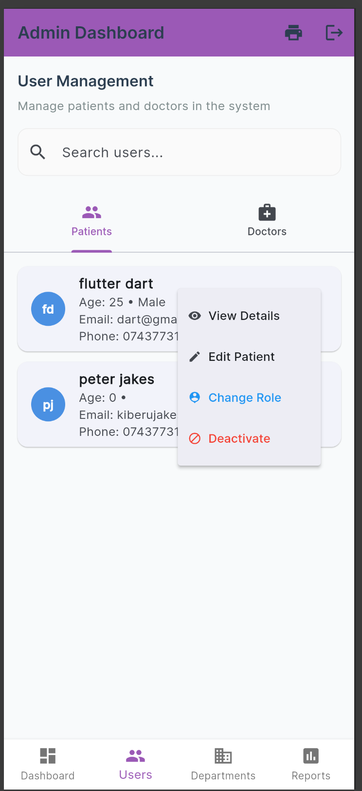 | 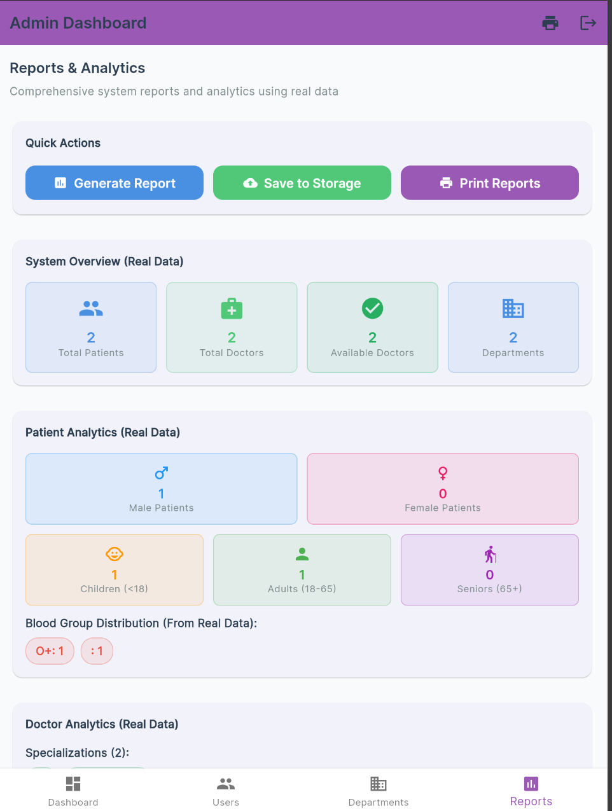 , 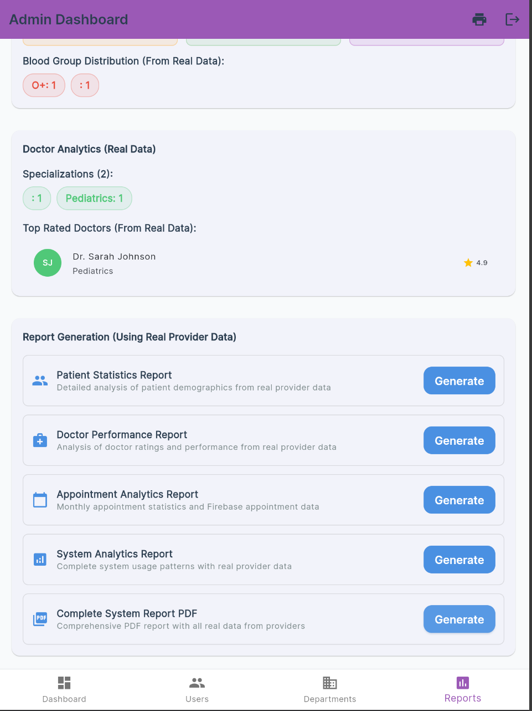 |


## �📁 Project Structure


lib/
├── const/                      # Constants and theme
│   ├── app_theme.dart         # App styling and colors
│   └── constants.dart         # Application constants
├── models/                     # Data models
│   ├── user_model.dart
│   ├── patient_model.dart
│   ├── doctor_model.dart
│   ├── appointment_model.dart
│   └── department_model.dart
├── providers/                  # State management
│   ├── auth_provider.dart     # Authentication state
│   ├── patient_provider.dart  # Patient data state
│   ├── doctor_provider.dart   # Doctor data state
│   └── appointment_provider.dart  # Appointment state
├── services/                   # Business logic
│   ├── auth_service.dart      # Firebase authentication
│   ├── firestore_service.dart # Firestore database operations
│   ├── image_service.dart     # Image upload/management
│   ├── mpesa_service.dart     # M-Pesa payment integration
│   ├── pdf_service.dart       # PDF generation
│   └── system_reports_service.dart  # Report generation
├── screens/                    # UI Screens
│   ├── auth/                  # Authentication screens
│   ├── patient/               # Patient-specific screens
│   ├── doctor/                # Doctor-specific screens
│   └── admin/                 # Admin-specific screens
├── widgets/                   # Reusable custom widgets
│   ├── custom_button.dart
│   └── custom_text_field.dart
└── main.dart                  # App entry point


## 🚀 Getting Started

### Requirements
- Flutter SDK: 3.8.1 or higher
- Dart SDK: 3.8.1 or higher
- Firebase Project
- Java JDK (for Android development)
- Xcode (for iOS development)
- Android Studio or VS Code

### Installation

1. **Clone the repository**
```bash
git clone https://github.com/Peterjakes/hospital_management_system.git
cd hospital_management_system
```

2. **Get Flutter dependencies**
```bash
flutter pub get
```

3. **Configure Firebase**
- Create a Firebase project at [Firebase Console](https://console.firebase.google.com)
- Download `google-services.json` for Android and place it in `android/app/`
- Download `GoogleService-Info.plist` for iOS and add it to Xcode
- Enable these services in Firebase:
  - Authentication
  - Cloud Firestore
  - Storage

4. **Run the app**
```bash
flutter run
```

### Running on Different Platforms
```bash
# iOS
flutter run -d iphone

# Android
flutter run -d android

# Web
flutter run -d web

# Windows
flutter run -d windows
```

## 🏗️ Architecture

The application follows a **layered architecture** with clear separation of concerns:

- **Presentation Layer** (Screens & Widgets): Handles UI and user interactions
- **State Management Layer** (Providers): Manages application state using Provider pattern
- **Service Layer**: Contains business logic and external integrations
- **Data Layer** (Models & Firebase): Manages data models and backend communication

### Design Patterns Used
- **Provider Pattern**: For state management
- **Service Locator**: For service dependency injection
- **MVC/MVVM**: For screen organization
- **Singleton**: For service instances

## 🔧 Key Services

### AuthService
Handles user authentication including login, registration, and session management using Firebase Auth.

### FirestoreService
Manages all database operations including CRUD operations for patients, doctors, appointments, and departments.

### ImageService
Handles image uploads and management using Cloudinary for cloud storage.

### MpesaService
Integrates M-Pesa payment gateway for appointment payments and financial transactions.

### PDFService
Generates PDF documents for medical reports, receipts, and appointment details.

### SystemReportsService
Creates comprehensive system reports and analytics for administrative purposes.

## 📱 Supported Platforms
- Android 5.0+
- iOS 12.0+
- Web
- Windows
- macOS
- Linux

## 🤝 Contributing

Contributions are welcome! Please follow these steps:

1. Fork the repository
2. Create a feature branch (`git checkout -b feature/AmazingFeature`)
3. Commit your changes (`git commit -m 'Add some AmazingFeature'`)
4. Push to the branch (`git push origin feature/AmazingFeature`)
5. Open a Pull Request


## 👨‍💻 Author
[Peter Jakes]

## 📧 Contact & Support
For questions, bug reports, or feature requests, please open an issue on the GitHub repository.

---

**Happy Coding! 🎉**
